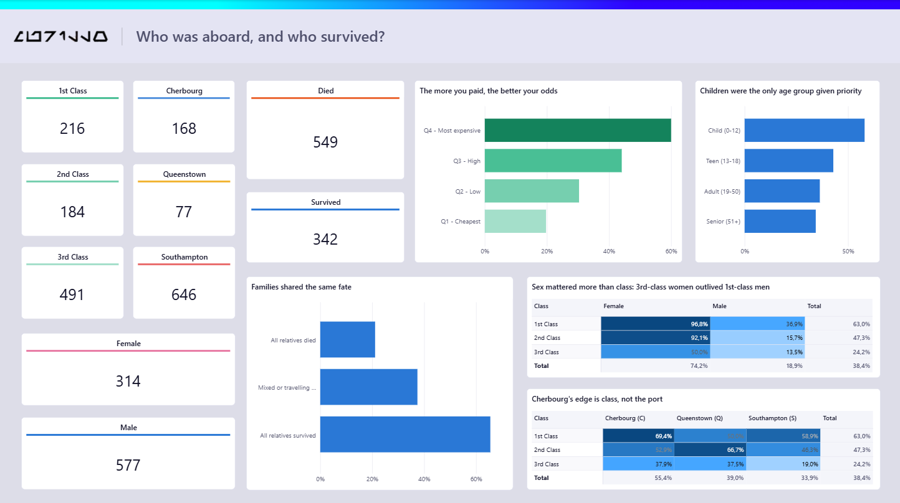

# 🚢 Titanic — Machine Learning from Disaster


An end-to-end pipeline for the classic [Kaggle Titanic Competition](https://www.kaggle.com/competitions/titanic) — from raw CSV
through feature engineering and a Random Forest classifier scoring **0.80861**, ending
in a five-page Power BI report that explains *why* the model works and *where* it fails.



---

## 📌 Project overview

Predict passenger survival using classification algorithms and feature engineering
over demographic, socio-economic, and family-structure data — then turn the result
into something a non-technical reader can actually interrogate.

---

## 🔑 Key engineering techniques

- **Social title extraction** (`Title`) — pulled from names (*Mr, Mrs, Miss, Master, Rare*) to capture age-gender-status combinations in a single feature.
- **Feature categorization** — binned `Age` into groups and `Fare` into quartiles (`FareGroup`) to reduce model noise.
- **Family structure** — combined `SibSp` and `Parch` into `FamilySize` plus an `IsAlone` binary indicator.
- **Family survival tracking** (`Family_Survival`) — built a family key from `Surname + Fare` and, for each passenger, looked at the fate of *the other* members of their group. The leave-one-out construction is what keeps it from simply copying the label.

---

## 🛠️ Tech stack

- **Language:** Python
- **Data processing:** `pandas`, `numpy`
- **Machine learning:** `scikit-learn` (`RandomForestClassifier`)
- **Visualization:** Power BI (star schema, DAX)

---

## 📊 Model performance evolution

| Version | Model / technique | Kaggle score |
|---|---|---|
| V1 | Baseline Random Forest | `0.77751` |
| V2 | Feature engineering (titles & family size) | `0.77751` |
| V3 | XGBoost Classifier experiment | `0.76794` |
| V4 | Age & fare grouping | `0.78229` |
| **V5 (final)** | **Family survival tracking + Random Forest** | **`0.80861`** 🎯 |

Worth noting that V3 went *down*. XGBoost on 891 rows with nine features overfits
where a depth-4 forest generalises — more model is not more accuracy.

---

## 📈 What the data says

**Overall survival rate: 38.4%** (342 of 891 passengers)

### Sex mattered more than class

| | Female | Male |
|---|---|---|
| **1st Class** | 96.8% | 36.9% |
| **2nd Class** | 92.1% | 15.7% |
| **3rd Class** | 50.0% | 13.5% |

A third-class woman (50%) was more likely to survive than a first-class man (36.9%).
The "women and children first" protocol outweighed wealth — but it was not applied
evenly: reaching the boat deck from third class was a different problem than reaching
it from a first-class cabin.

### The port of embarkation is a mirage

Cherbourg passengers survived at 55.4% against Southampton's 33.9% — but 50.6% of
Cherbourg boarded in first class, against 20.0% at Southampton. Most of the gap is
social class wearing a disguise. It doesn't vanish entirely (third-class Cherbourg
still beat third-class Southampton, 37.9% to 19.0%), so composition explains most of
the effect, not all of it.

### Family size has a sweet spot

Families of 2 to 4 fared best (55–72%). Solo travellers dropped to 30.4%. Groups of
five or more fell off sharply — but those buckets hold 6 to 22 people each, too few to
put a number on.

---

## 🤖 Model results

**Random Forest Classifier** · 100 trees · max depth 4 · 9 features

| Metric | Value |
|---|---|
| Accuracy (5-fold CV) | 85.3% |
| Precision | 86.8% |
| Recall | 72.8% |
| ROC AUC | 87.7% |
| **Kaggle public score** | **80.9%** |

### Feature importance

| # | Feature | Weight |
|---|---|---|
| 1 | Social Title | 31.4% |
| 2 | Sex | 28.3% |
| 3 | Passenger Class | 12.2% |
| 4 | Family Survival | 10.9% |
| 5 | Family Size | 6.4% |
| 6 | Fare Band | 5.8% |
| 7 | Age Group | 2.7% |
| 8 | Travelling Alone | 1.2% |
| 9 | Port of Embarkation | 1.0% |

Title and sex alone drive 60% of the decision. Port of embarkation — which looked
decisive in the descriptive analysis — lands second to last, confirming from the
model's side what the cross-tab already showed.

### Where the model fails

Error rate by group:

| | Female | Male |
|---|---|---|
| **1st Class** | 3.2% | **35.2%** |
| **2nd Class** | 7.9% | 7.4% |
| **3rd Class** | **22.2%** | 11.2% |

The model learned "women live, men die" and fails hardest on exactly the two groups
that break the rule — wealthy men and poor women. The failure mode is the finding.

---

## ⚠️ Two honest caveats

**The 85.3% / 80.9% gap.** Cross-validated accuracy runs 4.4 points above the real
Kaggle score. The likely cause is `Family_Survival`: it's built from the `Survived`
column itself, so even with the leave-one-out construction some target information
leaks into validation. The Kaggle number is the trustworthy one.

**177 imputed ages.** Missing `Age` values were filled with the median (28), which
dumps roughly a quarter of the "Adult (19–50)" bucket into a value nobody actually
had. The age analysis holds for children — who stand out clearly at 58% — but the
differences among the adult bands sit inside the noise.

---

## 📁 Dashboard

Five pages, built on a star schema rather than a flat table so the numeric codes in
the source (`Sex = 0/1`, `Pclass = 1/2/3`) resolve to readable labels with controlled
sort order.

| Page | Question |
|---|---|
| Overview | Who was aboard, and who survived? |
| Survival by Profile | Which traits predicted survival? |
| Family & Company | Did travelling with family help? |
| Fare & Social Class | How much did money matter? |
| Predicting Survival | Can a model learn the pattern? |

The palette was validated for colorblind separation rather than picked by eye:
adjacent categorical pairs clear ΔE 9.1 under protanopia simulation against the white
card surface. Sequential ramps are single-hue; diverging heatmaps use blue↔red with a
neutral midpoint anchored at the 38.4% overall rate.

---

## 🚀 How to run

**The notebook**

```bash
pip install pandas numpy scikit-learn
```

Open `titanic-machine-learning-from-disaster.ipynb` in Jupyter, Google Colab, or a
Kaggle notebook.

**The dashboard**

```bash
python build_dataset.py       # train.csv -> train_tratado.csv
python export_model_data.py   # -> ml_*.csv
```

Then open the `.pbix`, set the `ProjectFolder` parameter
(**Transform data → Manage parameters**) to wherever you cloned the repo, and refresh.
The report opens with data already loaded, so a refresh is only needed if you want to
regenerate it from your own run.

If numbers come out inflated by 10x, the CSV decimal separator is being read under a
non-English locale — the Power Query type step needs `"en-US"` as its third argument.

---

## 📂 Files

**Analysis**

| File | What it is |
|---|---|
| `titanic-machine-learning-from-disaster.ipynb` | Original notebook — feature engineering and model |
| `build_dataset.py` | Builds the treated dataset used by the report |
| `export_model_data.py` | Exports feature importance, out-of-fold predictions, metrics |
| `submission.csv` | Kaggle submission file |

**Dashboard**

| File | What it is |
|---|---|
| `Titanic - Machine Learning from Disaster.pbix` | The Power BI report — opens with data loaded |
| `model_card.dax` | Animated HTML model card measure |

**Data**

| File | What it is |
|---|---|
| `train.csv` · `test.csv` | Original Kaggle competition data |
| `train_tratado.csv` | Treated dataset — imputed values plus engineered features |
| `ml_predictions.csv` | Out-of-fold prediction per passenger |
| `ml_feature_importance.csv` | Feature weights from the trained forest |
| `ml_metrics.csv` | Accuracy, precision, recall, ROC AUC |

---

## 🔗 Links

- [Kaggle competition](https://www.kaggle.com/competitions/titanic)
- [My Kaggle profile](https://www.kaggle.com/murilloxavier)
